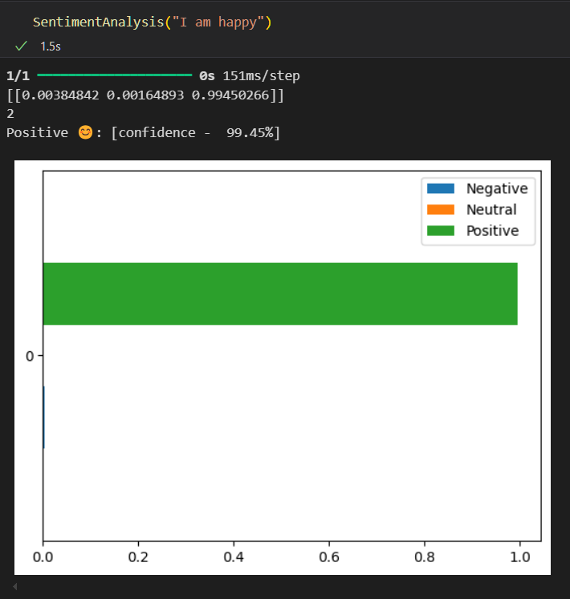

# Sentiment Analysis using LSTM

This project demonstrates how to perform sentiment analysis using a Long Short-Term Memory (LSTM) model. Sentiment analysis is the process of determining whether a piece of text is positive, negative, or neutral.

<!-- ## Table of Contents
- [Introduction](#introduction)
- [Installation](#installation)
- [Usage](#usage)
- [Dataset](#dataset)
- [Model Architecture](#model-architecture)
- [Results](#results)
- [Contributing](#contributing)
- [License](#license) -->

## Introduction

Sentiment analysis is a common task in Natural Language Processing (NLP). This project uses an LSTM model to classify the sentiment of text data.



## Installation

To get started, clone the repository and install the required dependencies:

```bash
git clone https://github.com/yourusername/sentiment-analysis-using-lstm.git
cd sentiment-analysis-using-lstm
pip install -r requirements.txt
```

<!--
## Usage
To train the model, run:
```bash
python train.py
```
To evaluate the model, run:
```bash
python evaluate.py
``` -->

## Dataset

The dataset used in this project is the [Sentiment Analysis Dataset](https://www.kaggle.com/datasets/abhi8923shriv/sentiment-analysis-dataset). It contains 50,000 movie reviews labeled as positive or negative.

## Model Architecture

The LSTM model is built using the following layers:

- Embedding Layer
- LSTM Layer
- Dense Layer

## Results

The model achieves an accuracy of 96% on the test set on 10 epochs.

## Contributing

Contributions are welcome! Please open an issue or submit a pull request.

## License

This project is licensed under the MIT License.
